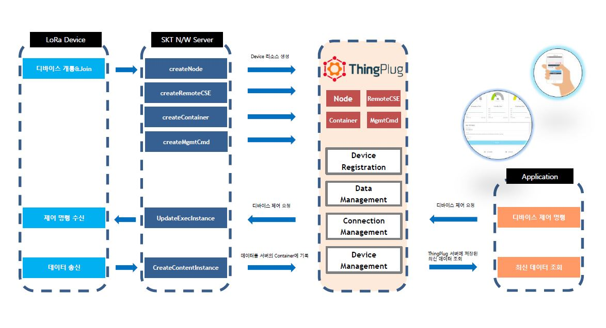
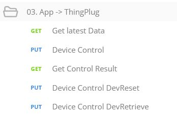

# Ubinet_서버

## LORA [OpenSource - 1]

- LoRa는 SK에서 제공해주는 네트워크 망으로써 전국에 설치된 IoT네트워크망입니다.

- 현재 설치된 IoT네트워크망 중 제일 넓은 지역과 제일 적은 비용으로 운용되고 있습니다.

- 분당에 OPEN-TESTBED에서 LoRa 관련 교육을 진행하고 있으며 , OPEN-HOUSE (Wiznet)에서도 심화된 교육을 진행하고 있습니다.

- 개발 이후에 상용화 단계에 접어들게 되면 최종 등록 이 후 전국에 설치된 LoRa망을 이용하여 서비스를 할 수 있습니다.


### Lora Architecture




  1. Lora모듈을 분당에 SK 자회사에서 구입한다. (인터넷으로도 구입 가능합니다.)

2. 디바이스 등록을 분당에 OPEN-TESTBED or WIZNET에서 진행한다.

3. LoRa모듈을 아두이노 보드에 연결하고 위에 센서를 달아서 작업한다.

4. 아두이노 코드에서 LoRa모듈을 통해 ThingPlug서버로 데이터를 전송하는 UpLink방식 코드를
  작성한다.

5. ThingPlug서버에 저장된 데이터들을 클라우드 서버에서 불러와 가지고 온다.

6. 불러온 데이터를 용도에 맞게 가공하여 서비스한다.

<hr />

## 디바이스 등록


- <https://sandbox.sktiot.com/> 


``` Thingplug 사이트에서 디바이스를 등록합니다.

등록 하는 과정에서 분당에 OPEN-TESTBED에서 등록 요청을 해야 합니다. 
```
```
위는 디바이스 등록 요청을 마친 뒤 등록한 상태입니다.
위 작업을 거친 후 Rest.api 인 POSTMAN을 활용해서 작업 내용을 확인하겠습니다. 
```


> # POSTMAN #


** Package.JSON **

[ Package.json 활용해서 POSTMAN 등록하기 (import) ] 


------------------------------------------------------------------------------------------------------------------------------




> 생성된 데이터는 여기서 정리됩니다. (Thingplug 서버에 데이터가 쌓이게 된다)
  Header값을 맞춰주어야 확인 가능합니다.


> 반드시! Subscription을 먼저 만들고 작업해야 합니다. ( NM == Subscription Name)
NM에 원하는 값을 넣어 주시고 만들어줘야 하는데 NM은 한 번에 3개까지 만들 수 있습니다.


   


[ need more tutorial -- arduino & server code tutorail ] 


># Sns 활용 로그인 api : [SNS] (https://haamseongho.github.io/ubinet/explain_oss/oss_map.html)
># Arduino 활용 UpLink api : [a link] ARDUINO (https://haamseongho.github.io/Android_lecture_by_Haam/)
># 지도API 활용 : [a link](https://github.com/Haamseongho/ubinet/blob/master/explain_oss/oss_map.html)
># QR코드 API 활용 : [a link](https://github.com/Haamseongho/ubinet/blob/master/explain_oss/oss_QRcode.html)
># LoRa & ThingPlug API 활용 : [a link](https://github.com/Haamseongho/ubinet/blob/master/explain_oss/oss_LoRa_ThingPlug.html)


