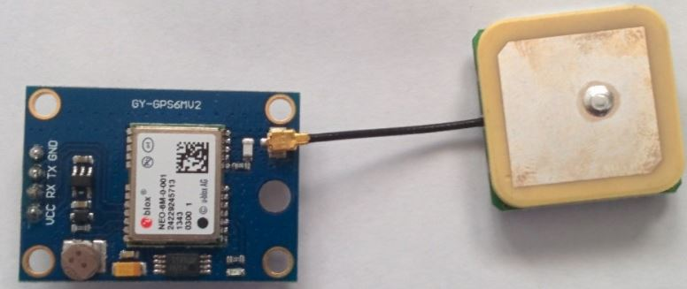

### TinyGPS 
---
- GPS센서 역할을 하여 기본적으로 위도와 경도를 측정하여 제공해준다.

## Download 

<a href="http://arduiniana.org/libraries/tinygps/"> TinyGPS 라이브러리 다운로드 및 예제 설명 </a>


---

### 사용 센서 
<br />




<br />

### 작업 순서 

---

1.위 링크를 따라 tinyGPS 라이브러리를 다운로드 받는다

2.아래 그림 처럼 zip파일로 받은 라이브러리를 아두이노에 추가한다.

<br />
 

3.추가한 라이브러리는 include를 써서 사용할 수 있다

```

	#include <TinyGPS.h>
	TinyGPS gps;

```

