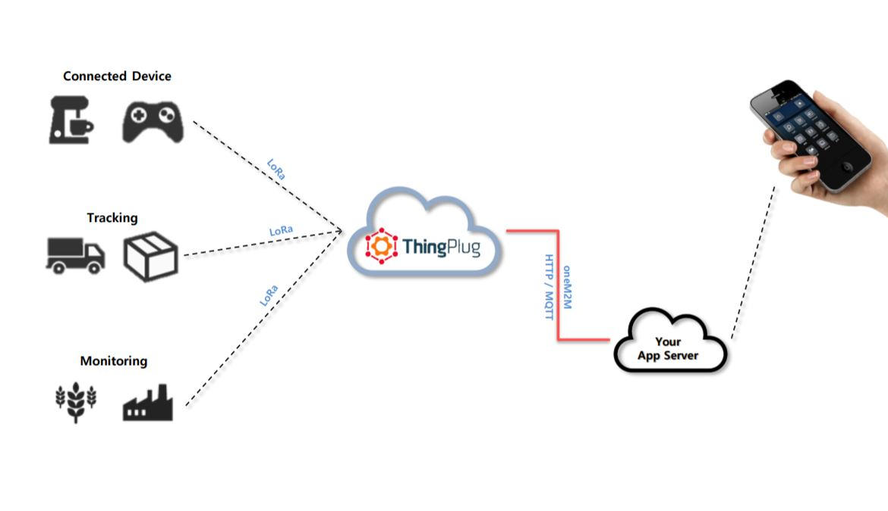
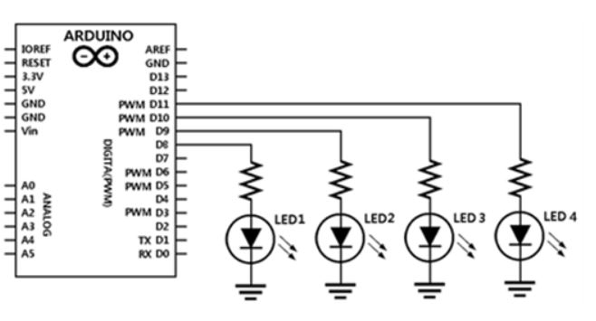

## Down-link 코드 소개 

### Down-link란?

- LoRa 네트워크 망에 저장된 데이터를 모듈로 받아 아두이노에 넘겨 주는 개념

 


위 그림은 업 링크 기본적인 개념을 보이는 이미지입니다.

위 그림 처럼 센서가 연결된 아두이노를 통해서 LoRa모듈로 데이터를 전송하고 전송한 데이터는 ThingPlug서버로 보내지는 것이 Up-Link입니다.

보내진 정보는 Application server로 보내져 가공하여 사용됩니다.

반대로 Down-Link는 Client부분에서 (웹/앱) Application server로 컨트롤 명령 데이터를 보냅니다.

<br />

보내진 명령 데이터는 ThingPlug 서버를 거쳐 LoRa모듈로 들어옵니다.

LoRa모듈로 들어온 명령 데이터를 아두이노에 역으로 전송하여 센서를 통제합니다.

이 과정을 Down-Link라 합니다.


---
### 과정 
<br />
---

 1 . 데이터를 역으로 받을 Serial 포트를 열어 둔다.

```

	String serial;
	void setup()
	{

 		int k = 8;
  		while(k<=11){
    			pinMode(k,OUTPUT);
    			k++;
  		}
  		
  		Serial.begin(38400);
	
	...
	...
			

```

 2 . Serial.read()로 Down-Link로 보내온 데이터를 읽어서 사용한다.

```
	void pinCheck(int pinNum){
  		digitalWrite(pinNum,HIGH);
  		if(pinNum <= 11)
    			delay(1000);
  		else
    			delay(1000);
  		digitalWrite(pinNum,LOW);
  
	}

	void loop(){

	int k;
  		
	
  	if(Serial3.available()){
    	char one;
    	one = Serial.read();
   		Serial.write(Serial3.read());
   		if(one=='\n'){
      		if(serial=="REAL_JOIN"){

        		for(k=8;k<=11;k++){
    				pinCheck(k);
  			}

        		serial="";
      		} 
    	}else
    		serial +=one; 

   	  }
    }


```

--- 

### 회로도 

---





열어 둔 시리얼 포트가 사용 가능할 때에 위 내용이 진행됩니다.

Serial3.read()로 읽어온 데이터에서 필요한 부분만을 뽑아서 변수에 저장합니다.

이 후에는 사용할 센서에 핀 번호를 연결하여 디지털 통신으로 보내게 합니다.

(현재는 Down-Link 진행 시에 LED가 불이 켜지도록 작업함 [8~11번 핀 번호] )


 
