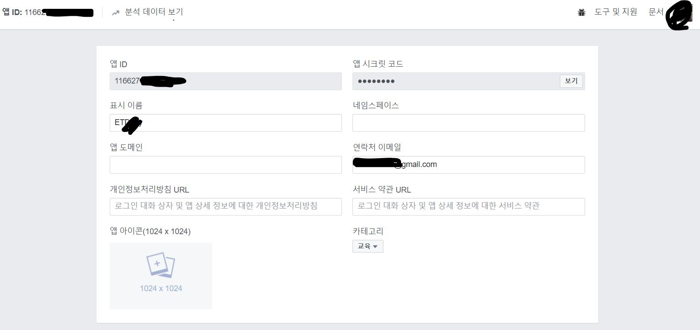

# SNS 로그인 
---
## Facebook 연동 로그인 


## 사용방법 

### 1. FACEBOOK Developer에서 나의 앱을 만든다.

<br />


페이스북 개발자 페이지에서 앱을 만들게 되면 위와 같은 데이터를 얻을 수 있습니다.


### 2. 다음은 서비스할 플랫폼을 설정하는 것인데 안드로이드 앱에 연동할 것이기 때문에 안드로이드를 선택해준다.

안드로이드 플랫폼을 선택하면 패키지 입력하는 것과 키 해시 값을 입력하는 부분이 있습니다. 

패키지는 안드로이드 프로젝트의 Manifest.xml에 있는 패키지 이름을 넣어주시면 되고 키 해시 값은 아래 링크를 참조해주시기 바랍니다.

<a href="http://mytalkhome.tistory.com/658" >Android - FacebookSDK - KeyHash 구하기 </a>

여기서 발생할 수 있는 문제가 있다면 여러 프로젝트를 만들면서 KeyHash를 너무 자주 가지고 와서 중복되는 경우가 발생할 수 있습니다.

이럴 경우 Key를 새로 generate (생성) 해서 KeyHash 값을 새로 받
으시면 됩니다.

<br />
 

---


위와 같이 작업을 한 뒤에 안드로이드로 넘어갑니다.

### 3. Manifest.xml 작업

```

		
        <meta-data
            android:name="com.facebook.sdk.ApplicationId"
            android:value="@string/facebook_app_id" />
        <meta-data
            android:name="com.facebook.sdk.AutoLogAppEventsEnabled"
            android:value="true" />

        <activity
            android:name="com.facebook.FacebookActivity"
            android:configChanges="keyboard|keyboardHidden|screenLayout|screenSize|orientation"
            android:label="@string/app_name" />
        <activity android:name=".signUp.LoginPage">
            <intent-filter>
                <action android:name="android.intent.action.VIEW" />

                <category android:name="android.intent.category.DEFAULT" />
                <category android:name="android.intent.category.BROWSABLE" />

                <data android:scheme="@string/fb_login_protocol_scheme" />
            </intent-filter>
        </activity>


```

위와 같이 <application>태그 안에 입력합니다.

<meta-data>태그로는 패이스북 개발자 사이트에서 받아올 수 있는 app키를 가지고 오고 페이스북 로그인 프로토콜 번호도 가지고 옵니다.

위 부분은 아래 링크를 꼭 참조해주시기 바랍니다.


<a href="https://developers.facebook.com/docs/facebook-login/android" > 페이스북 연동 로그인 
(Manifest.xml부분 - 4번 꼭 확인할 것) </a>
### 4. build.graddle 작업

> compile 'com.facebook.android:facebook-android-sdk:[4,5)'

위 내용을 컴파일해서 sync한다. 

이유는 페이스북sdk를 활용하기 위해서입니다.

### 5.   [activity_login_page.xml]

---

```

		
    <com.facebook.login.widget.LoginButton
        android:id="@+id/facebookLoginBtn"
        android:layout_width="300dp"
        android:layout_height="60dp"
        android:background="#35D6CF"
        android:text="Facebook"
        android:textAlignment="center"
        android:textColor="#ffffff"
        android:textSize="18sp"
        android:layout_marginBottom="20dp"
        android:layout_gravity="center"/>


```

xml 부분에 페이스북 로그인 버튼을 추가해 줍니다.

### 6. [LoginPage.java] 

---

1 . 페이스북 로그인 같은 경우는 CallbackManager를 활용해서 작업합니다.

> private CallbackManager callbackManager; 

2 . xml에 로그인 버튼의 아이디 값을 가지고와 객체로 만든다.

> facebookBtn = (LoginButton) findViewById(R.id.facebookLoginBtn);

: 여기서는 버튼 클릭 이 후 다른 페이지로 넘어가는 작업을 해주시면 됩니다.

3 . CallbackManager를 활용한 페이스북 토큰 받기 

```

		private void initFaceBookLogin() {
        callbackManager = CallbackManager.Factory.create();
        // 페이스북 callbackManager
        facebookBtn.setReadPermissions(Arrays.asList("public_profile", "email"));
        // 로그인 할 경우에 보여줄 퍼미션 설정 (public_profile : 기본 프로필 전부 ,  email : 이메일
        facebookBtn.registerCallback(callbackManager, new FacebookCallback<LoginResult>() {
            @Override
            public void onSuccess(final LoginResult loginResult) {
                GraphRequest graphRequest = GraphRequest.newMeRequest(loginResult.getAccessToken(), new GraphRequest.GraphJSONObjectCallback() {
                    @Override
                    public void onCompleted(JSONObject object, GraphResponse response) {
                        Log.i("facebook_login", object.toString());
                        try {
                            String name = object.getString("name");
                            String email = object.getString("email");
                            String gender = object.getString("gender");
                            fIntent = new Intent(LoginPage.this, MainPage.class);
                            fIntent.putExtra("name", name);
                            fIntent.putExtra("email", email);
                            fIntent.putExtra("gender", gender);

                            // 페이스북 토큰 저장
                            tokenStorage.savePreferences("F_Token", String.valueOf(loginResult.getAccessToken()));


                            Log.i(TAG,name+"/"+email+"/"+gender);
                            Log.i(TAG + "/token", tokenStorage.getPreferences("F_Token"));
                            startActivity(fIntent);
                        } catch (JSONException e) {
                            e.printStackTrace();
                        }
                    }
                });

                Bundle bundle = new Bundle();
                bundle.putString("fields", "id,name,email,gender,birthday");
                graphRequest.setParameters(bundle);
                graphRequest.executeAsync();
            }

            @Override
            public void onCancel() {

            }

            @Override
            public void onError(FacebookException error) {
                Log.e("facebook_login_error", error.toString());
            }
        });
    }


```

이 전에 선언한 CallbackManager로 페이스북에 콜백을 등록한다. 

xml에서 선언한 페이스북 로그인 버튼은 토큰을 요청하는 부분으로 이 버튼에 로그인 시 가지고올 개인 정보 퍼미션을 등록한다.

기본적으로 공개된 개인 프로필과 이메일 , 관심사 등 여러 항목들을 가지고 올 수 있습니다.

위 내용들을 버튼에 퍼미션 등록한 뒤 콜백을 등록합니다.

콜백은 callbackManager로 두고 페이스북 콜백을 콜백함수 선언 자리에 등록합니다.

>
> facebookBtn.registerCallback(callbackManager, 
new FacebookCallback<LoginResult>() {...} 

이 부분입니다. 

로그인 버튼에 퍼미션과 콜백을 등록한 뒤 , 로그인 시에 앞서 페이스북 개발자 사이트에서 작업한 내용들을 잘 정리했다면 로그인이 되어 들어갈 것입니다.

## GraphRequest
:페이스북 SDK를 안드로이드 내부로 불러와 관리하는 역할을 합니다.

여러 메소드들이 많은데 사용할 메소드는 newMeRequest()메소드입니다.

>  GraphRequest graphRequest = GraphRequest.newMeRequest(loginResult.getAccessToken(), new GraphRequest.GraphJSONObjectCallback() 


위와 같이 newMeRequest 메소드는 첫 번째 인자로 로그인 시에 갖는 AceessToken값 그리고 그에 대한 콜백을 줍니다.

Json 형태로 응답 데이터 값들이 넘어오기 때문에 이를 Object형태로 바꿔줘야 하고 이를 GraphJsonObjectCallback()이 시현합니다.

값은 성공 시에 object로 데이터들을 불러 올 수 있고 이 또한 Key-Value로 연결 되어 있어서 아래와 같이 데이터를 불러올 수 있습니다. (인증 이 후에 제시되는 데이터들)

```

		 String name = object.getString("name");
                            
		 String email = object.getString("email");
                            
         String gender = object.getString("gender");


``` 


---

위 토큰들은 SharedPreference를 활용하여 저장해주면 좋습니다.

<br />

