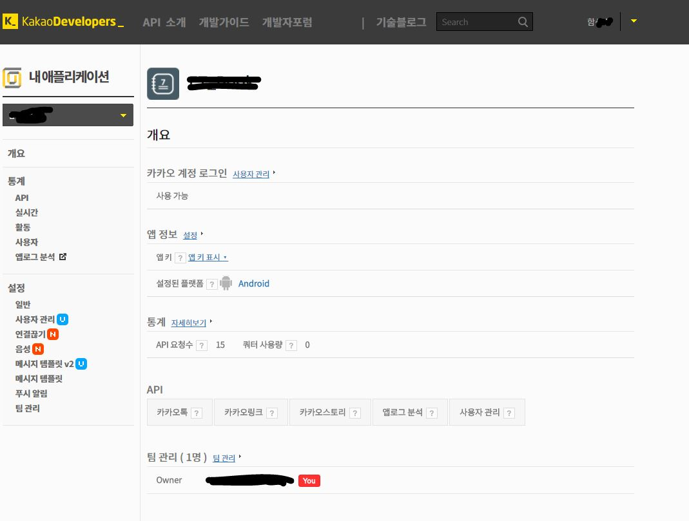
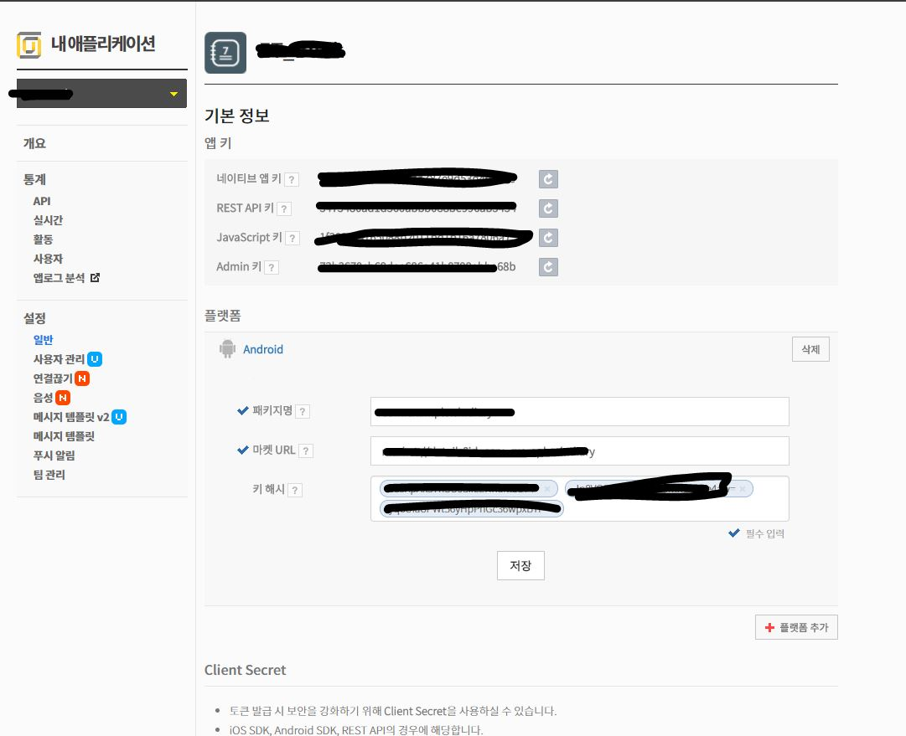
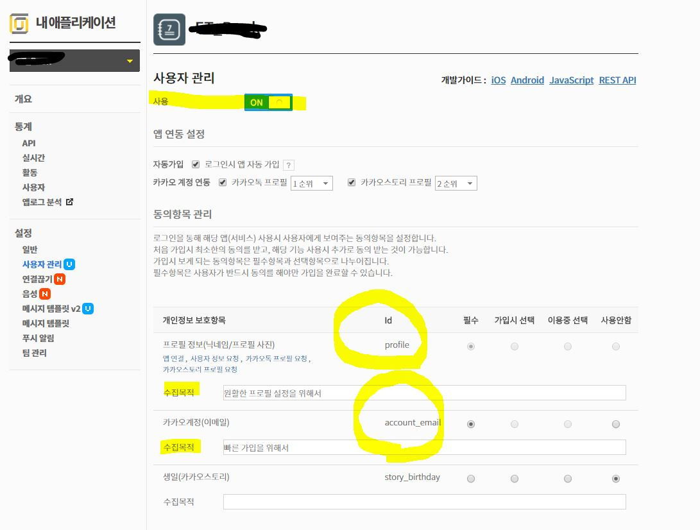

# SNS 로그인 
---
## Kakao 연동 로그인 


## 사용방법 

### 1. 카카오톡 개발자 사이트에서 로그인 한 뒤 앱을 생성한다.

앱을 생성하게 되면 아래와 같은 페이지로 들어올 것입니다.

<br />



<br />

### 2. 앱 정보에서 플랫폼을 안드로이드로 선택합니다.

선택하게 되면 아래와 같은 그림이 나오게 됩니다.

앱 키와 패키지명 마켓URL 그리고 키 해시값을 넣는 부분이 나옵니다.

키 해시값은 페이스북 로그인 연동 API 부분을 참조하여 추가해주시면 되고 

앱 키 같은 경우는 네이티브 앱 키를 이용할 것입니다.

<br />


 

<br />

Client Secret 부분은 카카오에서 기본적으로 제공하는 정보 뿐 아니라 더 개인적인 정보등을 가지고 올 때 토큰 값의 보안을 더 강화하고자 사용하는 것입니다.

폭 넓고 더 나은 서비스를 제공하기 위해선 Client Secret키도 발급받아서 작업해주시면 됩니다.

### 3. 퍼미션 허용 범위 설정하기 

<br />

 
<br />

위 그림 처럼 사용자 관리 파트에서 개인정보를 어디까지 풀어줄 것인지 체크하는 부분이 있습니다.
사용 부분은 물론 ON으로 작업해주시고 수집목적과 함께 개인 정보를 수집할 내용들을 체크해주시면 됩니다.

보다 개인적인 정보를 더 수집하기 위해선 앞서 말한 Secret Client Key를 발급받아야 합니다.


---

### 4. 안드로이드 Manifest.xml 설정

<application> 태그 내에 meta-data 태그로 카카오 앱 키와 
혹 ClientSecret 키도 발급 받았으면 아래와 같이 입력해줍니다.

```

	<meta-data
            android:name="com.kakao.sdk.AppKey"
            android:value="@string/kakao_app_key" />
        <!--
        <meta-data
            android:name="com.kakao.sdk.ClientSecret"
            android:value="---------------------"/>
        -->

```

>   <application
        android:name=".snsLogin.GlobalApplication"


application 태그의 name을 GlobalApplication으로 정의한다.

어플 시작시에 바로 GlobalApplication으로 넘어가서 KakaoSDK를 불러와 세션 작업을 진행할 예정이기 때문입니다.


### 5. build.graddle(project) / (Module:app) / gradle-properties 

1 . project 부분의 graddle에서는 아래와 같이 maven으로 url을 추가해줍니다.

```

	allprojects {
    	   repositories {
        	 jcenter()
    	   }
	}
	subprojects {
           repositories {
        	 mavenCentral()
        	 maven { url 'http://devrepo.kakao.com:8088/nexus/content/groups/public/' 
		 }
       }

```

2 . Module:app 부분의 graddle에서는 사용할 카카오 서비스의 내용을 컴파일합니다.

```

    compile group: 'com.kakao.sdk', name: 'usermgmt', version: project.KAKAO_SDK_VERSION
    // 카카오링크 sdk를 사용하기 위해 필요.
    compile group: 'com.kakao.sdk', name: 'kakaolink', version: project.KAKAO_SDK_VERSION
    // 카카오톡 sdk를 사용하기 위해 필요.
    compile group: 'com.kakao.sdk', name: 'kakaotalk', version: project.KAKAO_SDK_VERSION
    // 카카오스토리 sdk를 사용하기 위해 필요.
    compile group: 'com.kakao.sdk', name: 'kakaostory', version: project.KAKAO_SDK_VERSION
    // push sdk를 사용하기 위해 필요.
    compile group: 'com.kakao.sdk', name: 'push', version: project.KAKAO_SDK_VERSION


```

저희는 카카오연동 로그인만 할 예정이기에 usermgmt 부분만 컴파일하면 됩니다.

3 . gradle-properties

> KAKAO_SDK_GROUP=com.kakao.sdk
> KAKAO_SDK_VERSION=1.1.7 

아래 내용을 추가합니다. 
카카오 SDK 버전은 그 상황에 맞게 변화해주시고 
위 작업을 하지 않는다면 graddle에서 컴파일 시에 에러가 날 것입니다. 
(KAKAO_SDK_VERSION과 sdk를 가지고 올 수 없기 때문)


### 6. activity_login_page.xml

```

	
    <com.kakao.usermgmt.LoginButton
        android:id="@+id/kakaoLoginBtn"
        android:layout_width="300dp"
        android:layout_height="50dp"
        android:layout_marginBottom="20dp"
        android:layout_gravity="center"/>

```

usermgmt에서 로그인버튼을 불러와서 등록한다.

### 7. GlobalApplication.java


> KakaoSDK.init(new KakaoSDKAdapter());

onCreate() 메소드 내에 위와 같이 선언을 하고 KakaoSDKAdapter를 inner class로 정의한다.

```

	private static class KakaoSDKAdapter extends KakaoAdapter{
            	@Override
		    public ISessionConfig getSessionConfig() {

			 return new ISessionConfig() {
                   	 @Override
                   	 public AuthType[] getAuthTypes() {
                    	  // 로그인 시 타입 지정
                     	   return new AuthType[] {AuthType.KAKAO_LOGIN_ALL};
                  }

                @Override
                public boolean isUsingWebviewTimer() {
                    // SDK로그인 시 사용되는 WebView 진행시 pause나 resume 진행될 경우
                    // 타이머 설정으로 cpu 소모를 절약하는 방법
                    // return true 일 경우 타이머 설정이 필요.
                    return false;
                }

                @Override
                public ApprovalType getApprovalType() {
                      /*
                    일반 사용자가 아닌 Kakao의 제후된 앱에서 사용되는 값으로
                    값을 채워주지 않을 경우 ApprovalType.INDIVIDUAL 값을 사용한다.
                     */
                    return ApprovalType.INDIVIDUAL;
                }

                @Override
                public boolean isSaveFormData() {
                    // Kakao SDK에서 사용되는 WebView에서 email 입력폼에 데이터 save 할 지 여부 결정
                    return true;
                }
            };
        }


```

제일 중요한 부분으로 KakaoAdapter를 상속받는 KakaoSDKAdapter 클래스입니다.

각 상속 메소드들의 설명은 주석으로 처리하겠습니다.

### 8. LoginPage.java

> private SessionCallback callback;  // 카카오톡

카카오톡은 SessionCallback 클래스를 가지고 콜백함수를 불러온다.

```

	private void getSessionCallback() {
        	Log.i(TAG, "세션 시작");
       	 	try {
            		PackageInfo info = getPackageManager().getPackageInfo(this.getPackageName(),
                    	PackageManager.GET_SIGNATURES);
            		for (Signature signature : info.signatures) {
                		MessageDigest md = null; // 인증 후 서명 --> 암호화
                	try {
                   		 md = MessageDigest.getInstance("SHA");
                	    } catch (NoSuchAlgorithmException e) {
                    		e.printStackTrace();
                	    }
                	md.update(signature.toByteArray());
                	Log.i("KEY_HASH", Base64.encodeToString(md.digest(), Base64.DEFAULT));

            		}
        	} catch (PackageManager.NameNotFoundException e) {
            		e.printStackTrace();
        	}
        	callback = new SessionCallback();
        	Log.i(TAG, String.valueOf(Session.getCurrentSession()));

        	tokenStorage.savePreferences("K_Token", Session.getCurrentSession().getAccessToken());

        	// 카카오톡 세션에 대한 토큰 값 저장

        	Log.i(TAG + "/token", tokenStorage.getPreferences("K_Token"));
        	Session.getCurrentSession().addCallback(callback);
        	Session.getCurrentSession().checkAndImplicitOpen();

    	}


```

세션 콜백 메소드를 새로 만들어서 인증 후 서명 과정을 거칩니다.
이를 암호화한 뒤 안드로이드 내에서 사용할 KEY_HASH 값으로 정리합니다.

이 후에 세션 콜백을 두어 불러옵니다.

```

	private class SessionCallback implements ISessionCallback {

        	@Override
        	public void onSessionOpened() {
            		Log.i(TAG, "세션 성공");
            		redirectSignUp();
        	}

        	@Override
        	public void onSessionOpenFailed(KakaoException exception) {
           	 	Log.e(TAG, "세션 실패");
        	}
    	}

    		private void redirectSignUp() {
        		startActivity(new Intent(LoginPage.this, SignUpActivity.class));
        		finish();
    		}


```

위에서 선언한 세션 콜백은 inner class의 SessionCallback 클래스의 객체입니다.

SessionCallback의 콜백으로 등록된 위 클래스는 키 해쉬된 세션이 제대로 등록될 경우, 

다시 말하면 GlobalApplication 클래스가 먼저 수행되면서 카카오의 세션을 제대로 가지고 온 다음 이를 암호화 작업을 잘했다면 세션 성공으로 , 그렇지 못하다면 세션 실패로 넘어갈 것입니다.

위와 같이 작업한 뒤 성공 시에 SignUpActivity.class로 넘어가게 됩니다.
---

### SignUpActivity.java

```

    @Override
    protected void onCreate(Bundle savedInstanceState) {
        super.onCreate(savedInstanceState);
        setContentView(R.layout.activity_sign_up);
        requestMe();
    }

    private void requestMe() {
        UserManagement.requestMe(new MeResponseCallback() {
            @Override
            public void onSessionClosed(ErrorResult errorResult) {
                ErrorCode error = ErrorCode.valueOf(errorResult.getErrorCode());
                Log.e(TAG, String.valueOf(error));
                if (error == ErrorCode.CLIENT_ERROR_CODE)
                    finish();
                else {
                    Log.i(TAG, "사용자 인증 실패");
                    redirectHere();

                }

            }

            @Override
            public void onNotSignedUp() {
                Log.e(TAG, "카카오톡 회원이 아닙니다.");
            }

            @Override
            public void onSuccess(UserProfile result) {
                Log.i(TAG, "로그인 성공");
                redirectMainPage(result);
            }
        });
    }


```

카카오 로그인을 관리하는 usermgmt에서 UserManagement 클래스를 가지고 온다.

여기서 requestMe를 불러서 MeResponseCallback 메소드를 콜백으로 둔다.

(페이스북의 GraphRequest.newMeRequest와 같은 느낌)

여기서 카카오톡 세션을 다시 한 번 체크한 뒤 로그인 성공과 실패로 넘기게 됩니다.

마지막에 onSuccess(UserProfile result) { ... } 메소드
같은 경우는 세션 확인이 된 다음 로그인 되는 부분이기 때문에 인자인 result로 카카오톡에서 제공하는 기본 정보들을 가지고 올 수 있습니다. 

```

	private void redirectMainPage(UserProfile result) {
        	final Intent intent = new Intent(SignUpActivity.this, MainPage.class);
        	Log.i(TAG,result.toString());
        	intent.putExtra("nickname",result.getNickname());
        	intent.putExtra("id",result.getServiceUserId());
        	intent.putExtra("image",result.getProfileImagePath());

        	startActivity(intent);
        	finish();
	   }


``` 

