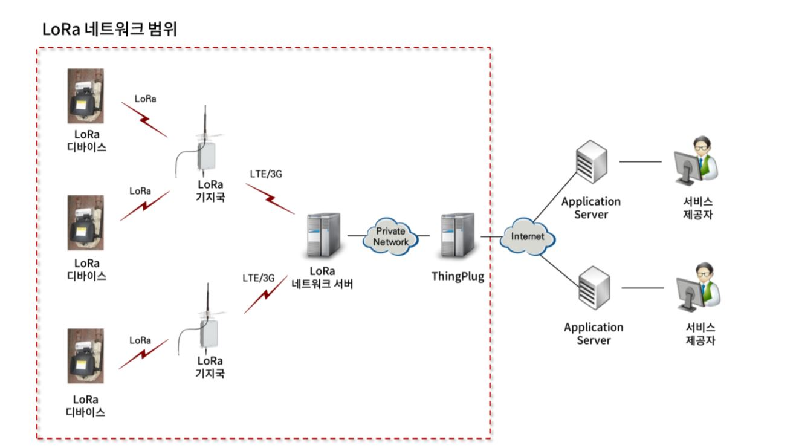
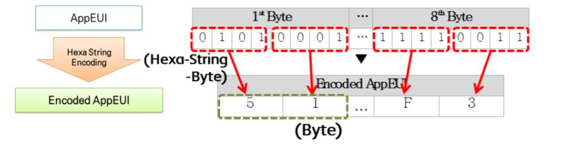
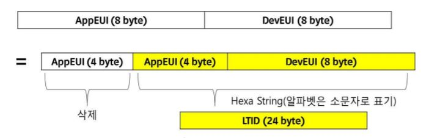
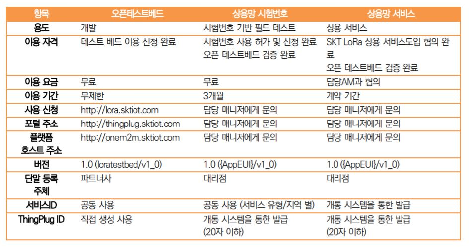
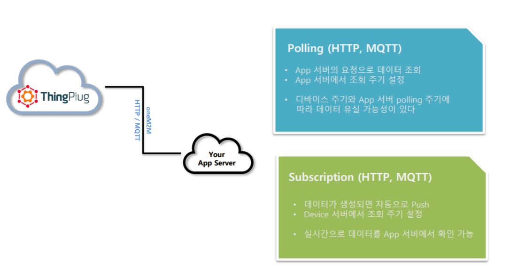
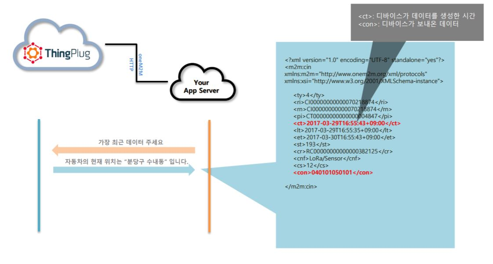
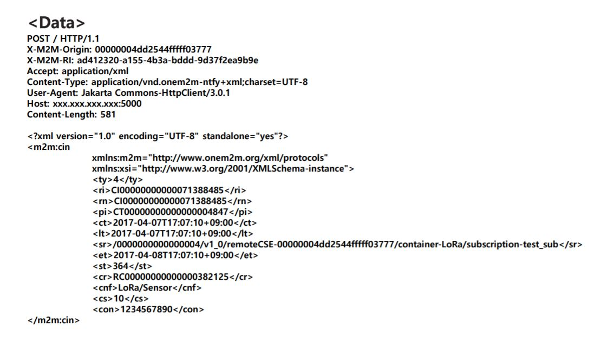

# 프로젝트 작업 영상

---

### 맥박 및 GPS 측정 

[](https://www.youtube.com/watch?v=2HHGHs1Up5E)


### 설명

현재 SK-IOT LoRa 네트워크 망은 전역에 설치되어 있습니다.
네트워크 망을 직접 이용하기 위해선 LoRa모듈이 필요합니다.

---
<a href="https://thingplug.sktiot.com/">
### ThingPlug 공식 사이트 </a>
---


LoRa모듈은 ThingPlug사이트에서 신청하여 구매 가능합니다.
LoRa 네트워크망은 전역에 설치되어 있지만 이를 사용하기 위해선 
상용화 과정이 필요합니다.

상용화 과정을 거친 뒤면 어디서든 사용 가능한 아이템을 쓸 수 있습니다.


### LoRa 네트워크 구조

</img>


----

- LoRa 기지국 : 전역에 구축되어 있으나, 제품 상용화 과정을 거쳐야만 사용가능합니다.
상용화 이 전에는 분당 Sk 오픈하우스 또는 SK 테스트베드에서 사용 가능합니다.

- LoRa망을 거쳐 데이터가 전송될 경우 ThingPlug라는 브로커(IoT망)을 거치게 됩니다
- ThingPlug 서버 망에 저장된 데이터를 클라우드 서버로 데이터를 가지고 와서 클라이언트에 서비스 합니다.

<br />

### LoRa 모듈 및 필요 데이터 

 

> AppEUI란?
>> 1. LoRa 서비스를 식별하는 식별자
>> 2. LoRa 네트워크 시스템에서 Application은 한 개 이
상의 LoRa디바이스로 구성된 동일한 서비스를 구성하는 그룹을 의미
>> 3. LoRa 표준에서 Application 식별자는 IEEE에서 정의한 64-bit의 EUI로 정의되고 이를 Hexa String 값으로 변환 하여 사용합니다.


<br />



> LTID란?
> > 1. LoRa(AppEUI & ThingPlug ID) 합쳐 놓은 것으로 단말(디바이스)를 구분하는 기준이 됩니다.
> > 2. (AppEUI + DevEUI) 내용으로 AppEUI 앞부분 4byte를 제외하고 Hexa String으로 나타낸 24byte값입니다. 알파벳은 소문자로 표기 됩니다.


### ThingPlug 환경 구성
<br />


<br />

### oneM2M : LoRa 디바이스 네트워크 망 (ThingPlug)


<br />

### 데이터 송수신 정책

###1. SubScribe 정책
	ThingPlug로부터 Push 메시지를 수신하기 위해서 또는
	Application Server가 ThingPlug로부터 요청에 대한 응답을 수신하기 위해서는 
	아래의 Topic과 Subscribe를 사용해야 한다.


```
	
	푸시를 받기 위한 Topic

	/oneM2M/req_msg/+/[clientID] 


```

```
	
	요청에 대한 응답을 수신하기 위한 Topic

	/oneM2M/resp/[clientID]/+


```

###2. Publish 정책
    메시징에서 중요한 부분 중에 하나가 발신자를 명확히 해야 한다.
	만약 발신자 정보를 위조해서 보내면 중대한 보안 사고가 발생할 수도 있기 때문에 
	ThingPlug MQTT프로토콜에서는 발신자가 실제 메시징을 
	발행(Publish)하는 객체가 되도록 제한한다. 
	oneM2M의 표준을 일부 차용하는 ThingPlug에서는 다음과 같은 Topic 구조를 가집니다. 


```

	ThingPlug 에 요청하는 API 호출인 경우 
	(App. Server to ThingPlug)

 	                     (From)               (To) 
	/oneM2M/req/[요청 메시지 발신자]/[요청을 수신하는 서비스]


```


```

	ThingPlug 로부터 요청의 응답을 수신하는 API 인 경우 
	(ThingPlug to App. Server)

 	                     (From)               (To) 
	/oneM2M/resp/[요청을 수신하는 서비스]/[요청 메시지 발신자]


```


### Polling <-> Subscription 비교

 


쉽게 설명하자면 ** Polling **  방식은 데이터가 
** ThingPlug ** 서버로 전송되었을 경우 들어오자마자 
데이터를 지속적으로 전송해주는 방식입니다.

그러기 때문에 디바이스 주기(디바이스 리셋과 같은)에 따라서 
데이터가 유실될 수 있습니다.

** Subscription ** 방식은 위의 Polling방식과 ThingPlug 서버로 데이터가 지속적인 전송은 동일합니다.
다만 해당 서버에서 데이터를 클라우드 서버로 전송할 때에 조회 주기를 조정할 수 있습니다.

예 :) 10개의 데이터가 들어올 경우 하나의 묶음으로 보내겠다. [== subscription] 


<hr />

### Resource 활용 태그 및 구조

 

<br />

- ri : 자원에 대한 값 (Resource ID)
- rn : 자원에 대한 이름 (Resource Name)
- ct : 만들어진 시간 (Create Time)
- et : 만기 시간 (Entire Time)
- sr : /{APP EUI}/v1_0/remoteCSE-{Dev ID}/container-LoRa
/subscription-{Sub name} 

---

	- <sr> : 여기서 LTID를 문자열 관리를 통해서 필요한 데이터(예: LTID)를 가져올 수 있습니다.

---

- con : 데이터 결과물 


---

	- <con> : 여기서 업링크된 데이터를 가져다 쓸 수 있습니다.

---

<br />



