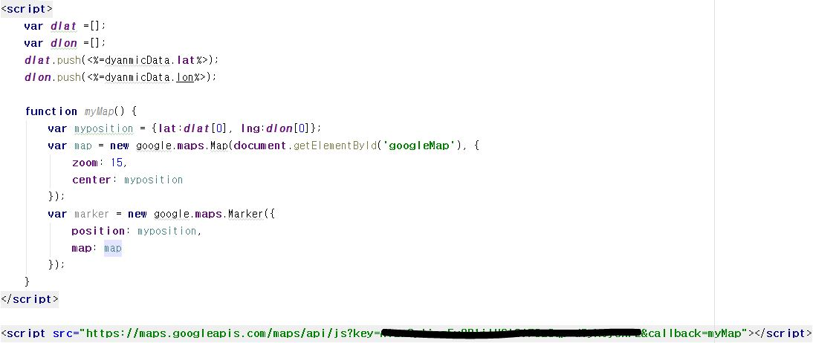
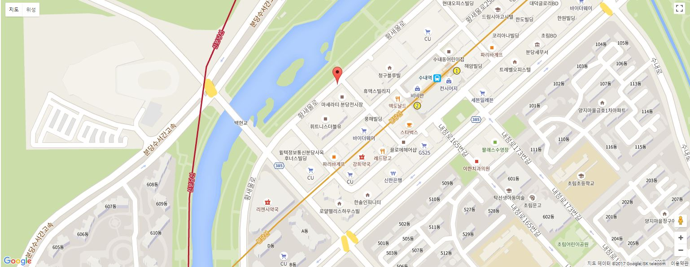

# 웹 
---

## Google Map Api

### 구글맵 사용 과정

1 . 구글 개발자 사이트에서 API키를 받아옵니다.
#### <https://developers.google.com/maps/documentation/directions/get-api-key?hl=ko>

2 . 구글맵이 보여질 View 파일에서 (map.ejs) 위도,경도를 설정 한다. 





<br />

3 . 위 그림대로 위도와 경도를 배열로 설정한다.

cf:) dynamicData는 LoRa모듈의 Up-Link를 통해 받아 온 위도와 경도 데이터 정보입니다.

4 . 해당 배열에 받아 온(Up-Link) 위도,경도를 넣어준다.

```

	function myMap() {
        var myposition = {lat:dlat[0], lng:dlon[0]};
        var map = new google.maps.Map(document.getElementById('googleMap'), {
            zoom: 15,
            center: myposition
        });
        var marker = new google.maps.Marker({
            position: myposition,
            map: map
        });
    }


```

5 . 저장한 위도,경도를 가지고와서 위치 변수에 넣어준다.

6 . 아래 스크립트에 가져온 부분에서 받아 온 API-KEY를 이미지에 지워진 부분에 추가해줍니다.

7 . 위 내용과 같이 작업을 한 뒤 googleMap 아이디로 준다.

8 . html태그에 googleMap 아이디를 주는 div 태그를 설정해 준다.

9 . googleMap 아이디로 준 div 태그에 Up-Link로 받아 온 위도,경도가 웹 지도 상에 뜨게 됩니다.

 

<br />

<hr />

## License

